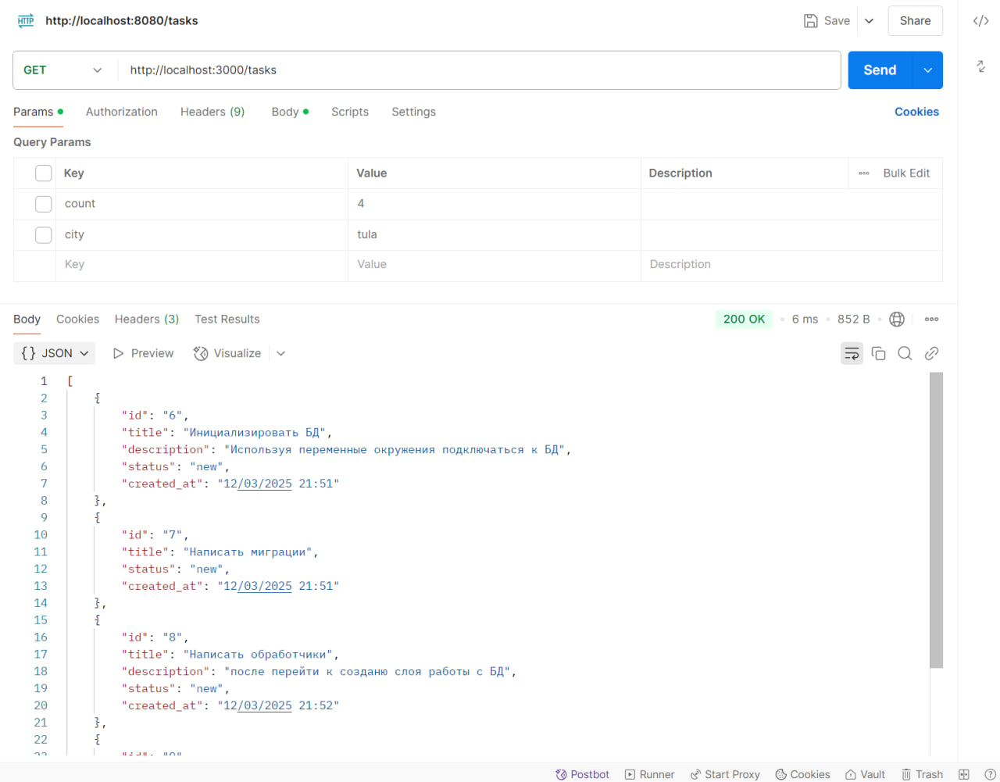
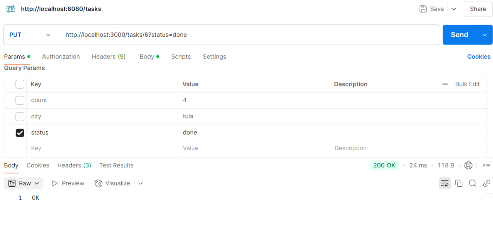
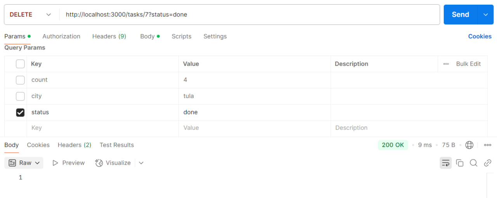
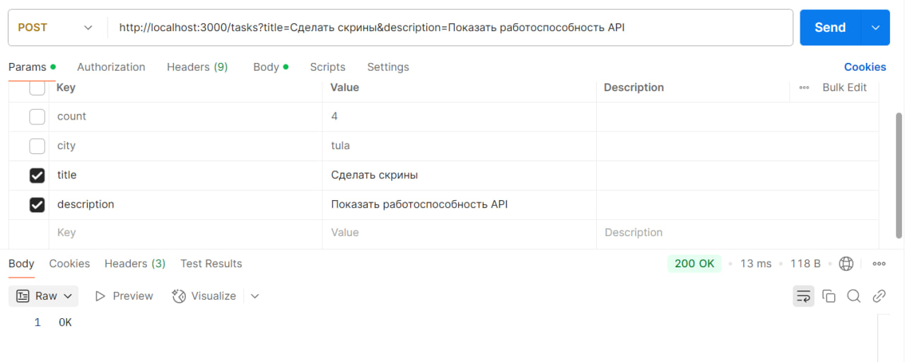
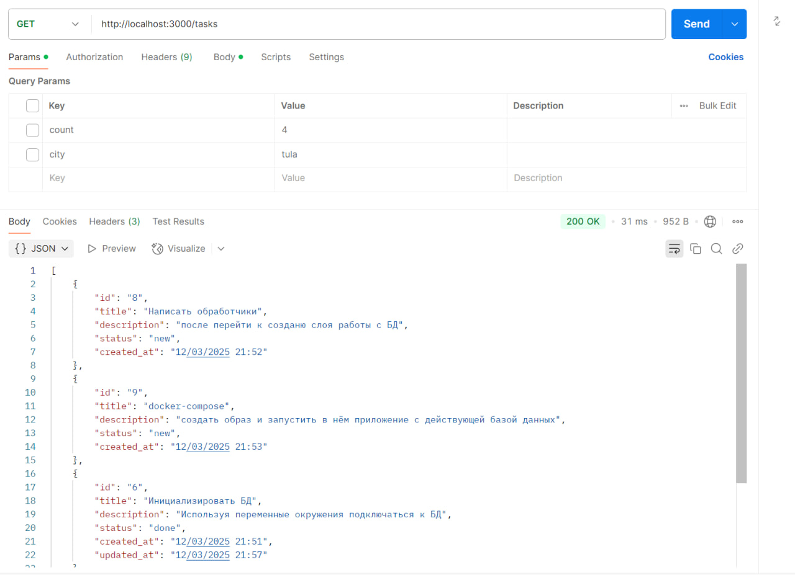
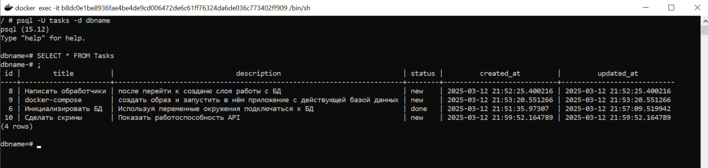

# Описание проекта

Этот проект предназначен для ведения учёта задач. Он запускает сервер, который по адресу `http://localhost` (при стандартных настройках) предоставляет пользователю доступ к удобному интерфейсу управления задачами.

---
## Функционал проекта

Проект реализует CRUD задачи для сервиса todolist в связке с PostgreSQL. Аргументы которые можно задавать при запросе:
title - название/заголовок задачи. Является основным и единственным обязательным при добавлении новой задачи.
description - описание задачи.
status - статус задачи, принимает только значения "new", "in_progress", "done". Можете отправлять запросы с пустым статусом, при создании он станет 'new', а при обновлении строки сохранит прежний статус.

Примеры запросов: 
1) GET-запрос по эндпоинту /tasks - выводит список всех задач.
2) POST-запрос по эндпоинту /tasks - принимает параметры title, status и description. Создаёт новую задачу.
3) DELETE-запрос по эндпоинту /tasks/:id - удаляет задачу с заданным id.
4) PUT-запрос по эндпоинту /tasks/:id - принимает параметры title, status, description. Обновляет задачу с заданным id.

## Структура проекта

```plaintext
- /cmd
  - /todolist
    - main.go         - Точка входа в приложение.
- /internal
  - /handlers        - Логика HTTP-обработчиков.
    - handlers.go    - Основные обработчики.
  - /models
    - models.go       - Модели данных, используемых проектом.
  - /repository      - Работа с базой данных.
    - connect.go      - Инициализация базы данных.
    - tasks.go       - Методы для взаимодействия с базой данных.
- /migration
  - 001_init.sql    - SQL-скрипт для инициализации базы данных.
- .env               - Переменные окружения проекта.
- .gitignore         - Игнорируемые файлы для Git.
- go.mod             - Файл модулей Go.
- go.sum             - Контрольная сумма зависимостей.
```

## Локальный запуск
База данных запускается при помощи `docker-compose up -d` из локальной папки проекта.
Используйте .env файл в котором будете хранить значения:
  1) TODO_DBUSER=tasks (имя пользователя для подключения к БД)
  2) TODO_DBPASS=tasks (пароль для подключения)
  3) TODO_DBHOST=localhost (хост для подключения к БД)
  4) TODO_DBPORT=5432 (порт на котором запускается PostgreSQL)
  5) TODO_DBNAME=dbname (имя бд инициализированное в docker-compose.yml)
  6) TODO_PORT=3000 (порт который будет слушать приложение)
Вызывайте localhost или 127.0.0.1 и через двоеточие указывайте выбранный порт.

## Инструкция по сборке Docker и запуску контейнера
В терминале из корневой папки проекта `docker-compose up -d`. После завершения сборки приложение будет запущенно на указанном порте. Свои переменные окружения можете задавать при помощи флага -e. Они все описаны. Если хотите слушать другой порт. Его указываете и в docker-compose.yml.

## Скриншоты работоспособности







